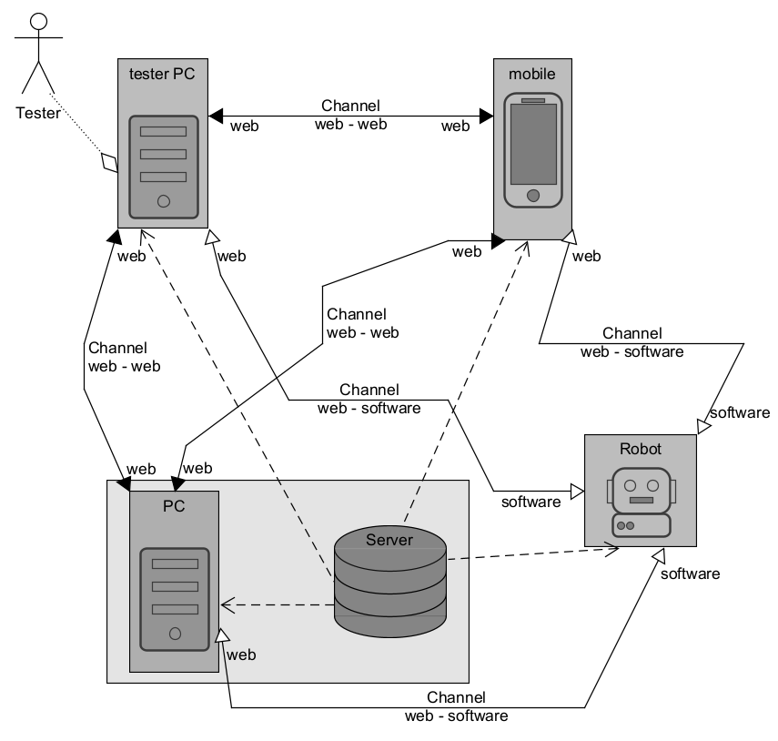

# Web_Speech_Remote_control

The project presents the compilation of an AI assistant with online remote voice control



### api

```
./api
```

#### My setup

```
cd api
poetry install
poetry run python manage.py runserver 0.0.0.0:8000
```

### open ngrok and write

```
ngrok http 8000
```

### open

```
~/electron
```

### in renderer.js code change line with your ngrok adress 

```
var wsStart = 'wss://e70f-193-19-165-84.ngrok-free.app';
```

### in index.html code change line with your ngrok adress 

```
<meta http-equiv="Content-Security-Policy" content="default-src 'self'; connect-src 'self'    wss://e70f-193-19-165-84.ngrok-free.app;">
```


### type

```
npm run build
npm run start
```

### log in with differents name on websites and test typing on browser

#### if electron app opened on windows

```
start chrome
start python
```

