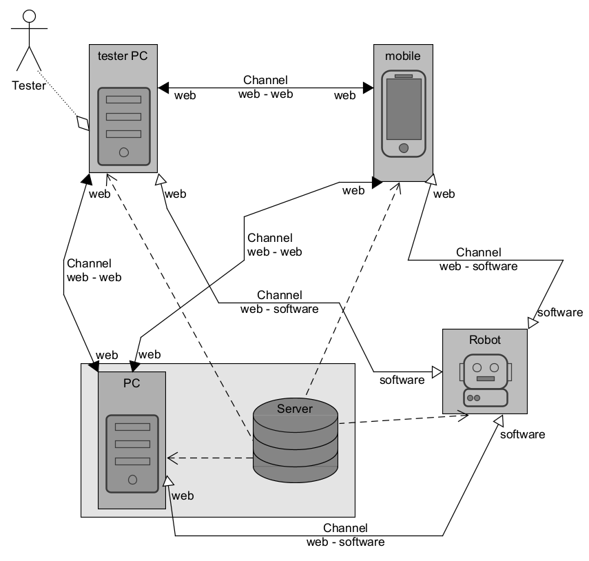

# Introduction

This project is a comprehensive integration of modern software and hardware technologies, designed to control a robotic rover using a combination of Python, Electron, ROS 2, Django, and micro-ROS. The system bridges web technologies, embedded systems, and robotics to enable real-time communication, advanced robot control, and seamless collaboration. By leveraging tools like FreeRTOS and Tailscale, it ensures efficiency, scalability, and robust remote access.




## Key Components and Features:
### Python-Based ROS 2 Package:

- Provides control for the rover’s wheels using velocity commands (geometry_msgs/Twist) published to ROS 2 topics (/diff_drive_controller_left/cmd_vel_unstamped and /diff_drive_controller_right/cmd_vel_unstamped).
- Includes a Python publisher for programmatic control and CLI tools for quick testing and debugging.
### Backend API with Django:

- Facilitates real-time text chat and robotic control via a Python-based server.
- Integrates advanced features like speech recognition and LLM-powered interactions.
- Supports remote sharing and collaboration using Tailscale for secure access.
### Electron-Based Frontend:

- Acts as a user-friendly interface for interacting with the rover.
- Supports synchronized chat and WebSocket-based communication for real-time robot control.
- Features cross-platform compatibility for deployment on various devices.
### Micro-ROS on ESP32:

- Enables lightweight communication between the ESP32 microcontroller and ROS 2.
- Uses FreeRTOS for real-time task management, ensuring efficient operation of motors, sensors, and communication tasks.
- Publishes commands to ROS 2 topics over Wi-Fi using UDP transport.
### FreeRTOS and ESP-IDF Integration:

- Provides a robust multitasking environment on ESP32 for handling communication, motor control, and sensor data.
- Ensures deterministic behavior essential for real-time robotic applications.
## Use Cases:
- **Robotic Rover Control**: Send movement commands, enable remote keyboard navigation, and leverage advanced features like audio/video management and speech-based interactions.
- **Real-Time Communication**: Synchronized chat across multiple platforms with live feedback and terminal integration.
- **Collaborative Development**: Remote access via Tailscale, allowing multiple users to test and interact with the system in distributed environments.
- **IoT and Robotics Integration**: Seamless communication between embedded devices and ROS 2 nodes for scalable IoT applications.

# Testing (after initial configuration of all project components available in appropriate subfolders)

1. setup django server
```bash
cd ~/Web_Speech_remote_control/api
poetry run python manage.py runserver 0.0.0.0:8000
```
1.5 setup react frontend
```bash
cd ~/Web_Speech_remote_control/frontend_ws
npm run dev
```

2. setup tailscale
```bash
sudo tailscale serve reset

sudo tailscale funnel --bg --set-path /ws http://127.0.0.1:8000
sudo tailscale funnel --bg --set-path /api/login/ http://127.0.0.1:8000/api/login/
sudo tailscale funnel --bg --set-path /api/register/ http://127.0.0.1:8000/api/register/
sudo tailscale funnel --bg --set-path / http://127.0.0.1:5173


# to turn off 
# tailscale funnel --https=443 off

# turn tailscale on device to control the robot
```
go to website using generated address from url with react port ...etc. https://name.tail123g3a.ts.net/

3. setup electron app or ros2_webrtc_bridge
```bash
#electron
cd ~/Web_Speech_remote_control/electron
npm run start

#bridge
cd ~/Web_Speech_remote_control/teleop_bringup/
export ROBOT_ID=g1pilot
python3 bridge.py
```

4. run teleop_bringup
```bash
cd ~/Web_Speech_remote_control/teleop_bringup/
source ~/ros2_projects_ws/install/setup.bash

source install/setup.bash
ros2 launch teleop_bringup twist_joy_g1.launch.py 
```

5. run unity simulation
```bash
## automated distrobox command
cd ~/ros2_projects_ws
./scripts/distrobox
## in new distrobox terminal run simulation
ros2 launch knml_bringup sim_basic.launch.py 

#simple run simulation
cd ~/ros2_projects_ws && distrobox enter kalman_ws -- bash -c "source install/setup.bash && ros2 launch knml_bringup sim_basic.launch.py"
```